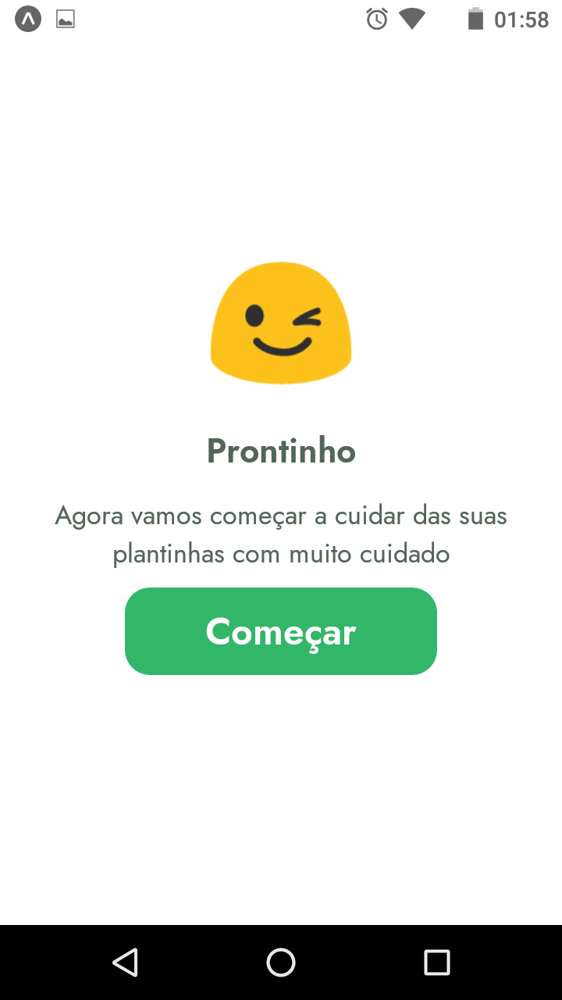
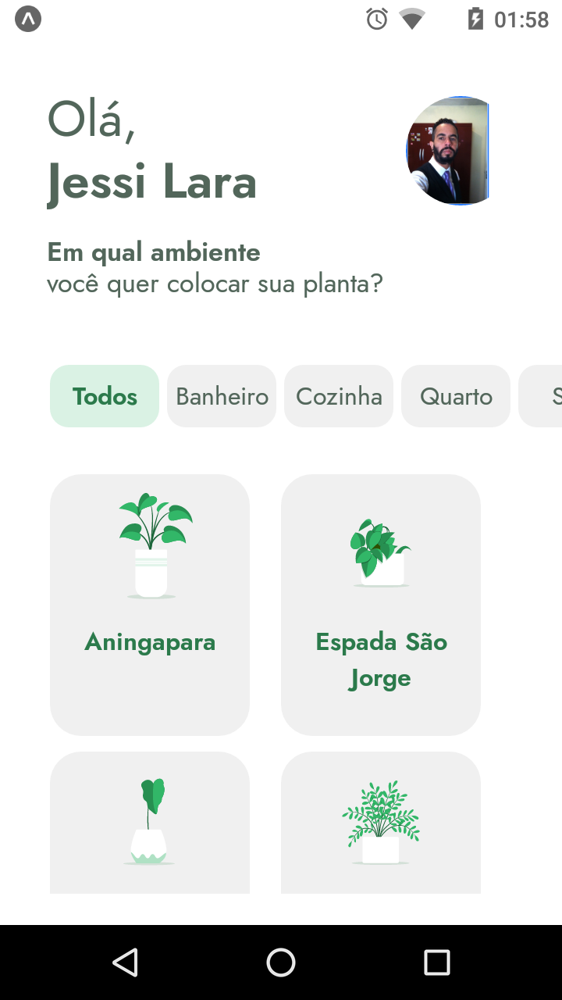
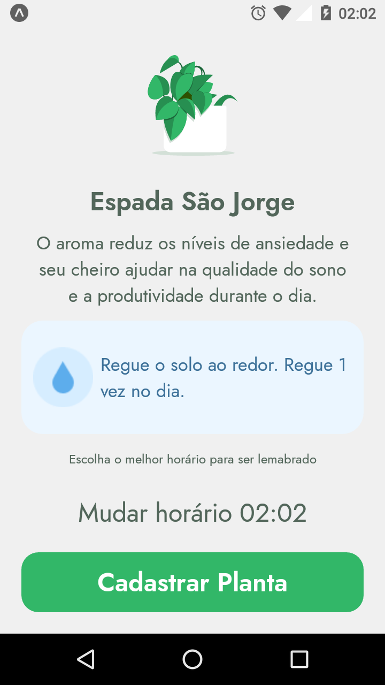
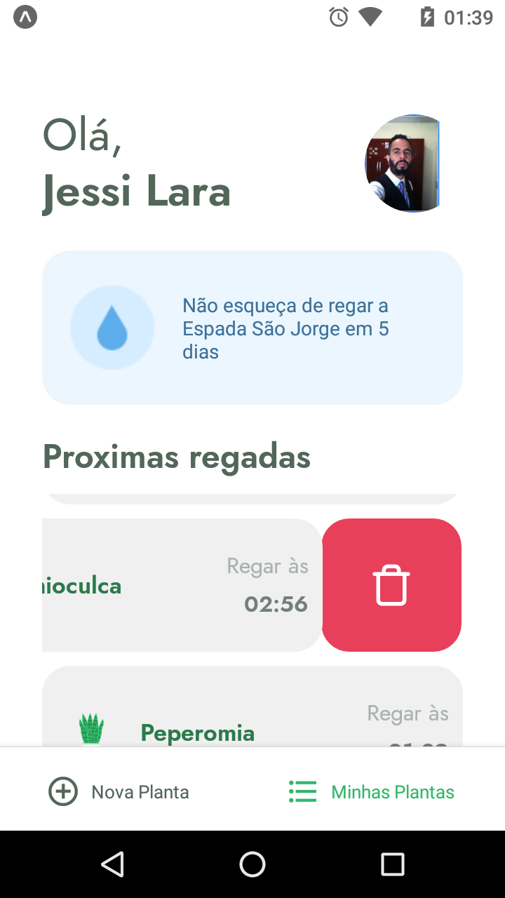

<h1 align="center">
   
</h1>

# PlantManager

Plant Manager is an app to remind people to water their plants.

# Screens

<p align="left">

&nbsp; &nbsp; &nbsp; &nbsp;

&nbsp; &nbsp; &nbsp; &nbsp;

&nbsp; &nbsp; &nbsp; &nbsp;

&nbsp; &nbsp; &nbsp; &nbsp;

&nbsp; &nbsp; &nbsp; &nbsp;

</p>

## Technologies used
  - [React Native](https://reactnative.dev)
  - [Expo](https://docs.expo.io)
  - [Typescript](https://www.typescriptlang.org)
  - [Styled Components](https://www.styled-components.com)

## Requirements

You need to install both [Node.js](https://nodejs.org) and [Yarn](https://yarnpkg.com) or npm to run this project.

## How to use it

```bash
  # Install the dependencies
  $ yarn install
  # Run the backend fake server
  $ yarn server
  # Run app
  $ expo start
```

The app will be available for access on your browser at (http://localhost:19002)
